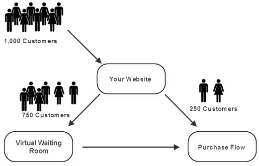

# Queue

## I. Introduction


Waiting in line is a part of everyday life because as a process it has several important functions. Queues are a fair and essential way of dealing with the flow of customers when there are limited resources. Negative outcomes arise if a queue process isn’t established to deal with overcapacity. (Illustrated as lining up for the slide above)

## II. Common Usage of Queue

Queues are commonly used in places where overcapacity occurs. If there is no overcapacity, no queues are needed.

You will see queues are restaurants, postal office, grocery stores, and etc. However, not all the queues are physically present in real life.

Queues are commonly used via internet as well! Since there is no a physical queue line, we have created a queue data structure which helps maintaining order in the virual life.



In the above example, we see that the queue (in this case, virtual waiting room) is being applied to this shopping website. The website capacity can only handle 250 customers at a time, however, there are 1000 customers on the line/purchasing items from the website. This caused a queue to be created according to the order of the customers' entering time.

The important takeaway here is the purpose of the queue. It is not only acting as a waiting place for those 750 customers, but it also organizes the order of the customers to determine who can exist the queue first/who will be the next customer to be served (according to the queue rules and mechanisms).

Let's examine how we can apply these queue rules and mechanisms next.

## III. Common Queue Operation & Efficiency

First, I would like to mention how a queue in Python is initiated.
A queue in Python is defined as a dynamic list.

```python
queue = []
```

I have put together four different operations to apply queue rules and mechanisms, let's take a closer look at them.

## Enqueue:

The first and foremost operation for a queue is to enter the queue. To do this, we have to first identify the insertion location of the operation. Generally, we insert a new item to the end of the queue.
Insert to the end:

```python
queue.append(item)
```

The performance of this operation is O(1).

## Enqueue to a specific location:

We sometimes will have to insert an item to the beginning of the queue, or in the middle of the queue. This situation is rare, however, to accomplish this, we can pass in the index location to indicate which position we want to insert the item.

```python
queue.insert([position], item)
```

The performance of this operation is O(n), because we have to push all the items after the inserting position back a position in the list.

## Dequeue:

We need to have a way for an item to exist the queue, the most common way to exist an item is to pop the item that is located at the beginning of a queue.

```python
queue.pop(0)
# or
del queue[0]
```

The performance of this operation is O(n), because we have to push all the items after the first item in the list forward a position.

## Dequeue from a specific location:

We can also remove an item from a specific location in the queue.

```python
queue.pop([index])
# or
del queue[[index]]
```

The performance of this operation is O(n), because we have to push all the items after the selected item in the list forward a position.

## Get the size of a queue:

To know how long the queue is, we can use python's built-in len() function.

```python
len(queue)
```

The performance of this operation is O(1).

## Checking if the queue is empty:

We can check if the queue is empty by simply checking if the length of a queue is 0.

```python
if len(queue) == 0
```

The performance of this operation is O(1).

## IV. Example: Queue to a roller coaster at Disney

In the following example, some customers are lining up for a roller coaster ride. Since there are a lot of people wanting to get onto the ride and the seats are not enough to accomendate all the customers, a queue/line needs to be developed to assist over capacity.

### Queue Requirements

1. Allow more customers to enter the queue
2. Always take the customer who entered the queue the earilest first to the next ride.
3. If there is a special customer (Who bought a special ticket for faster access), put him/her to the beginning of the line.
4. check if the queue is empty, when it's empty, dequeue operation should do nothing.

```python
# Initialize an empty queue
queue = []

# Enqueue function
queue = []

# Enqueue function
def enqueue(customer, special = False):
    # check if the customer has a special ticket
    if special == False:
        queue.append(customer)
    else:
        queue.insert(0, customer)
    return queue


def dequeue():
    # Check if the queue is empty
    if len(queue) != 0:
        queue.pop(0)
    return queue

enqueue("Jackson")
print(queue) # ["Jackson"]
enqueue("Talia")
print(queue) # ["Jackson", "Talia"]
enqueue("Bob", True)
print(queue) # ["Bob", "Jackson", "Talia"]


queue = dequeue()
print(queue) # ["Jackson", "Talia"]
queue = dequeue()
print(queue) #["Talia"]
queue = dequeue()
print(queue) #[]
```

## V. Problem to Solve

Write a program to manage the the hot line queue provided by a bank. There are often more people on the line than the agents they have in a bank, overcapacity will occur, specially on the weekends.

### Requirements:

1. Your queue must handle adding a new waiting spot for the hot line.
2. The queue must be ordered according to the entrance time to the hot line.
3. If the call is from another agent, the order of this call must be put to the front (All agent numbers start with 333).
4. Your program will do nothing if the hot line is empty, meaing nobody is on the line.
5. Your program can handle dequeue from the middle of the queue, if someone decided to call again later.

### Starting code:

```python
# Initialize the queue
queue = []

def checkIsAgent(number):
    # Return is the number starts with 333

def enqueue(caller):
    if checkIsAgent(caller) == False:
        # Put the caller to the front of the queue
    else:
        # Put the caller to the end of the queue

def dequeue(caller = ''):
    if len(queue) == 0:
        pass
    else:
        if caller == '':
            # Dequeue from the end
        else:
            for i in range(len(queue)):
                # Loop through the queue to find the caller who wants to exist the queue.

# Test cases
enqueue('123456789')
enqueue('968158561')
enqueue('345623413')
enqueue('333908531')
dequeue()
dequeue("345623413")
print(queue) # ['123456789', '968158561']
```

You can check your soluction here: [Solution](./1-queue-solution.py)
