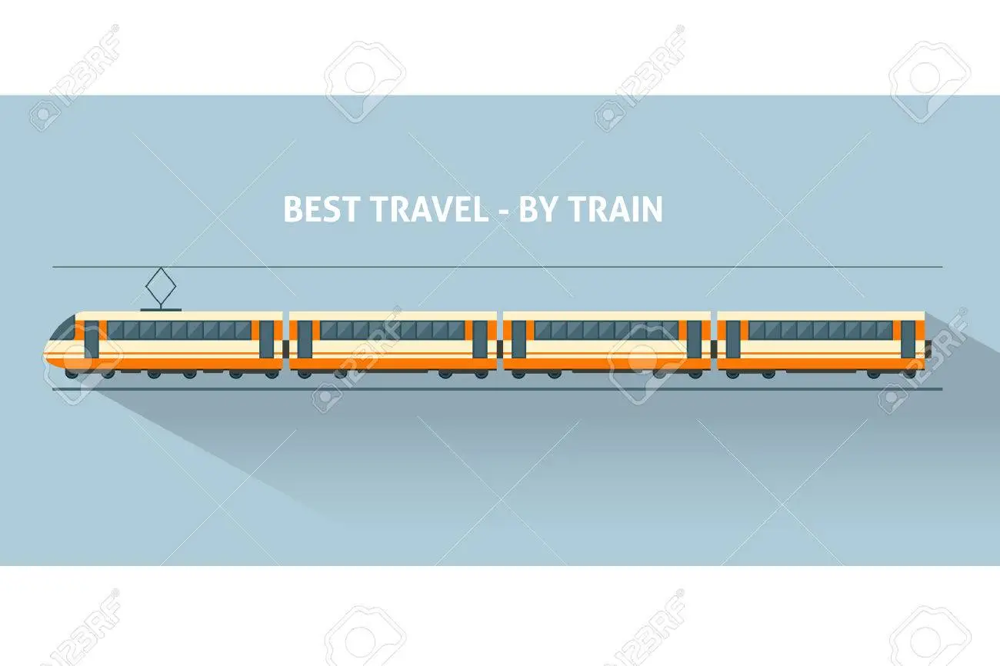

# Linked List

## Structure

Ever been on a train before? Have you wondered how train cabins are attached together? Yes! Today we are going to learn about how to build a train together! First of all you will need a mechanical degree from BYU-I....


Wrong channel, let's try again!

Today we are going to learn about how to use the train structure to deal with our data.

Let's envision the cabins as pieces of data, we call them nodes. The entire train is the container of the data, which we call it a linked list.

A train has a beginning and an end, we call them head and tail in our linked list. Each cabin is attached to another cabin (Unless it's the head or the tail), we will call the cabin to the left prev and the cabin to the right next.

```python
def __init__(self):
    # Initialize an empty linked list.
    self.head = None
    self.tail = None
```

```python
def __init__(self, data):
    # Initialize the node to the data provided.  Initially
    # the links are unknown so they are set to None.
    self.data = data
    self.next = None # will be replaced by another cabin/node when there is one
    self.prev = None # will be replaced by another cabin/node when there is one
```

It is not an exaggeration to say that the structure of a linked list is the same with the structure of a train, let's examine it a little further below.

## Linked List Manipulation

## Add to/remove from the head

### Adding:

1. Create a new node
2. Set self.next of the new node to the head node of the existing list

```python
new_node.next = self.head
```

3. Set self.prev of the head node of the existing list to the new node

```python
self.head.prev = new_node
```

4. Set the head of the list to the new node

```python
self.head = new_node
```

To visualize this, you can think of this process as adding a new cabin to the front of the train. It requires the new cabin to be hooked up to the existing head cabin of the train, setting self.next of the new cabin to the old head cabin and self.prev of the old cabin to the new cabin. Once they are hook, we need to re-name the cabins. The old head cabin is in the second position now, so we take away the name from it and give it to the new head cabin which is the new cabin added to the head.

### Removing:

1. Set self.prev of the second node to None

```python
self.head.next.prev = None
```

2. Set self.head of the list to the second node

```python
self.head = self.head.next
```

Taking the train example, we first disattach the first cabin of the train, then we re-name the head to the the second cabin of the train.

### Efficiency:

The operation of both processes is O(1)

## Add to/remove from the tail

### Adding:

1. Create a new node
2. Set self.prev of the new node to the tail node of the existing list

```python
new_node.prev = self.tail
```

3. Set self.next of the tail node of the existing list to the new node

```python
self.tail.next = new_node
```

4. Set the tail of the list to the new node

```python
self.tail = new_node
```

You may apply the same principles from adding to the head here to help you visualize this process.

### Removing:

1. Set self.next of the second to the last node to None

```python
self.tail.prev.next = None
```

2. Set self.tail of the list to the second to the last node

```python
self.tail = self.tail.prev
```

Taking the train example, we first disattach the last cabin of the train, then we re-name the tail to the the second to the last cabin of the train.

### Efficiency:

The operation of both processes is O(1)

## Add to/remove from the middle

Adding the middle is the most complex process of the linked list manipulation, let's assume that we are inserting a node after node A

### Adding:

1. Create a new node
2. Set self.prev of the new node to node A

```python
new_node.prev = A
```

3. Set self. next of the new node to be the next node after node A

```python
new_node.next = A.next
```

4. Set self. prev of the next node of the A node to be the new node

```python
A.next.prev = new_node
```

5. Set self.next of node A to be the new node

```python
A.next = new_node
```

To help you understand this process, you can incorporate the method of hooking up 2 sets of cabins using the above example. The only difference is that we are not changing our head or tail of the train, we are only hooking a cabin up to the middle of the train.

### Removing:

Let's assume we are removing node A from somewhere in the list

1. Set the node before node A to be the precious node of the node after node A

```python
A.next.prev = A.prev
```

2. Set the node after node A to be the next node of the node before node A

```python
A.prev.next = A.next
```

### Efficiency:

The operation of both processes is O(n), it takes n times for the program to find the inserting/removing position.

## Search within a Linked List

We often need to find a node in the linked list, we call it accessing from a linked list. Just like the train example we have been using throughout this page, we can think of it as finding a person in the entire train from the cabins.

To find a person from the train, there isn't an efficient way other than going to each cabin from the head cabin down to the tail. If we are lucky, we might find the person in the first one, but luck can't always accompany us, in which we might have to go down to the last cabin, the tail to find our person. The finding operation is O(n). The same as we loop through a linked list and try to find an item, we go through each node and compare its data value with our targeted value.

```python
def findPerson(self):
    # Start at the beginning (the head)
	current = self.head
    person = "Jackson"

	# Loop until we have reached the end (None)
	while current is not None:
        if current.data == person:
		    # Do something with the current node
		    print("We found your person ", current.data, "!")

        # Follow the pointer to the next node
        current = current.next
```

Using the same concept, we can use print() function to display each node value in the linked list by looping through the entire list from the head to the tail. The efficiency of this operation is O(n)

## Linked List Operation & Efficiency

| Operation     | Performance | Explanation                                                                                                                                                                                  |
| ------------- | ----------- | -------------------------------------------------------------------------------------------------------------------------------------------------------------------------------------------- |
| insert_head   | O(1)        | Only needs to adjust the the pointers of the head, the new and old head node.                                                                                                                |
| insert_tail   | O(1)        | Only needs to adjust the the pointers of the tail, the new and old tail node.                                                                                                                |
| insert_middle | O(n)        | Only needs to adjust the the pointers of the middle, the new and old nodes relating to the middle. O(n) performance comes with looping and finding the middle (targeted) insertion location. |
| remove_head   | O(1)        | Only needs to adjust the the pointer of the head, the new head node.                                                                                                                         |
| remove_tail   | O(1)        | Only needs to adjust the the pointer of the tail, the new tail node.                                                                                                                         |
| remove_middle | O(n)        | Only needs to adjust the the pointers of the middle, the nodes relating to the middle. O(n) performance comes with looping and finding the middle (targeted) deletion location.              |
| length        | O(1)        | Built-in python function                                                                                                                                                                     |
| empty         | O(1)        | Just check the length to see if it's 0                                                                                                                                                       |

## Example: Shopping at a grocery store

The example below is a real life application of the linked list data structure. We sometimes need to line up for checking out at a grocery store, this is where a linked list structure come in to play.

### Requirements:

1. Customers can enter the queue from the end. (Add to the tail of the linked list)
2. If a customer has a friend or family member who is already in the queue, he/she can cut in after him/her. (Insert to the middle)
3. If a customer is a employee of the store, he/she can go to the front of the line. (Add to the head of the linked list)
4. A customer can be asked to leave the queue/line at anytime. (Removing from the linked list.)
5. The boss needs to be able to see all customers in the line. (Loop through the linked list)

```python
class LinkedList:
    def __init__(self):
        # Initialize an empty linked list.
        self.head = None
        self.tail = None


    class Node:
        def __init__(self, data):
            # Initialize the node to the data provided.  Initially
            # the links are unknown so they are set to None.
            self.data = data
            self.next = None
            self.prev = None

    def employee_insertion(self, name):
        new_node = LinkedList.Node(name)

        if self.head is None:
            self.head = new_node
            self.tail = new_node

        else:
            new_node.next = self.head
            self.head.prev = new_node
            self.head = new_node

    def remove_head(self):
        # Remove the first node (i.e. the head) of the linked list.
        if self.head == self.tail:
            self.head = None
            self.tail = None

        elif self.head is not None:
            self.head.next.prev = None
            self.head = self.head.next

    def customer_insertion(self, name):
        new_node = LinkedList.Node(name)

        if self.tail is None:
            self.head = new_node
            self.tail = new_node

        else:
            new_node.prev = self.tail
            self.tail.next = new_node
            self.tail = new_node

    def remove_tail(self):
        if self.tail == self.head:
            self.head = None
            self.tail = None
        elif self.tail is not None:
            self.tail.prev.next = None
            self.tail = self.tail.prev

    def customer_with_fam_or_friend_insertion(self, friend_or_fam_name ,name):
        new_node = LinkedList.Node(name)

        current = self.head
        while current is not None:
            if current.data == friend_or_fam_name:
                if current == self.tail:
                    self.insert_tail(name)
                else:
                    new_node.prev = current
                    new_node.next = current.next
                    current.next.prev = new_node
                    current.next = new_node
                return

            current = current.next

    def remove_customer_from_line(self, name):
        current = self.head
        while current is not None:
            if current.data == name:
                if current.prev == None:
                    self.remove_head()
                elif current.next == None:
                    self.remove_tail()
                else:
                    current.prev.next = current.next
                    current.next.prev = current.prev
                return
            current = current.next

    def all_customer_names(self):
        current = self.head

        while current is not None:
            print(current.data)
            current = current.next

list = LinkedList()

list.customer_insertion("Jackson")
# The Line: Jackson

list.employee_insertion("Talia")
# The Line: Talia, Jackson

list.customer_insertion("Bob")
# The Line: Talia, Jackson, Bob

list.customer_insertion("James")
# The Line: Talia, Jackson, Bob, James

list.customer_insertion("Eric")
# The Line: Talia, Jackson, Bob, James, Eric

list.customer_with_fam_or_friend_insertion("Jackson", "David")
# The Line: Talia, Jackson, David, Bob, James, Eric

list.remove_customer_from_line('James')
# The Line: Talia, Jackson, David, Bob, Eric

list.all_customer_names()
```

## Problem to Solve

You are developing a game, the game is call 'snake'. You want it to be different than the regular snake games and you have added some special features to it.

1. Your snake needs to be linked list.
2. Your snake should consist different section, each section should have a color.
3. Your can use the same color for sections.
4. The snake will become longer when it runs into food. The food has different colors which give a section to the snake.
5. The food also has an indicator which indicates whether is helps the snake to grow the head or the tail.
6. The snake can't eat rotten food, if it did, the rotten food will take away some of the section of the snake.
7. The rotten food will have an indicator which will say a color, all the sections with that color will be gone from the snake.

```python
class Snake:
    def __init__(self):
        # Initialize an empty linked list.
        self.head = None
        self.tail = None


    class Section:
        def __init__(self, data):
            # Initialize the section to the data provided.  Initially
            # the links are unknown so they are set to None.
            self.data = data
            self.next = None
            self.prev = None

    def insert_head(self, color):
        # create a new section
        # create insertion logics

    def remove_head(self):
        # deletion logics

    def insert_tail(self, color):
        # create a new section
        # create insertion logics

    def remove_tail(self):
        # deletion logics

    def add_middle()
        # We don't need this function for the game, you can skip!

    def remove_middle(self, color):
        # deletion logics

        # Tip: we don't need to return here once the first matching section is found, we continue the process until all the matching sections are deleted.


    def show_snake_sections(self):
        # Loop through and show each section's data

snake = Snake()

food = [(0, 'red'),(0, 'red'),(0, 'orange'),(1, 'blue'),(2, 'red'),(0, 'red'),(1, 'yellow')]

for i in food:
    if i[0] == 0:
        snake.insert_head(i[1])
    elif i[0] == 1:
        snake.insert_tail(i[1])
    else:
        snake.remove_middle(i[1])


snake.show_snake_sections()
# red, orange, blue, yellow
```

See the solution here: [Solution](./2-linked-list-solution.py)
