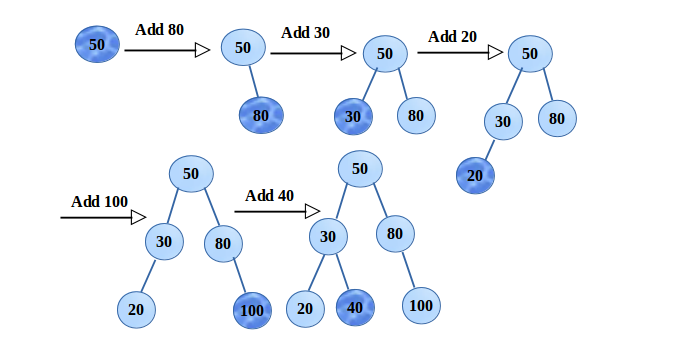
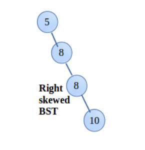
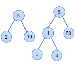

# IV. Tree

## Introduction

Trees act like linked lists, they have nodes and are connected by pointers. The difference of a tree than a linked list is that a tree is able to connect to many different nodes.
Let's examen different tree types.

## Binary tree

Here is a binary tree:

The characteristics of a binary tree are the following:

1. A node can only be linked to no more than 2 nodes. (The two nodes can be linked to other nodes as well)
2. A binary tree always starts with a root node, which is the node that's on the top. (Node 56)
3. The nodes that are not connected to other nodes are called leaf nodes. (Nodes 3, 16, 40, 63, 67, 95)
4. A node that has any connected nodes are called parent nodes.
5. A node that is connected from a node on the top is called a child node to the parent node.
6. Nodes that have the same parent are called siblings. (Nodes 22 and 40)
7. The nodes to the left or right of the parent node consist a subtree. (Nodes starting from node 11)

## Binary Search Tree

A binary tree follows the characteristcs of a tree with insertion rules for the data that is being put in to the tree. We will call a binary tree a BST now.
To insert a piece of data into a BST, we will have to compare the inserting data with the data of the node we are inserting to.



For example, we are inserting 50, 80, 30, 20, 100, 40 in order. We can see that there is a comparison happening with each insertion. The comparison is between the data we are trying to insert, and the data value of the node we are inserting into. The insertion will compare these two data values, if the inserting data is smaller, it would be put to the left, vice versa.

A tree data structure with the binary rules applied, you now can have a tree with organized, ordered data which improves data finding more efficient.

### Problem

However, a problem called 'unbalancy' will occur even if we insert an array of data in order.



Take a look at this right skewed BST, we are inserting 5, 8, 8, and 10 in an ascending order. However, you will realized that this tree is unbalanced, imagine what would happen if there was 100+ pieces of data in order! The tree, if you would even call it a tree, will be just a single line of nodes all skewed right.

## Balanced Binary Search tree

The solution to the problem of 'unbalancy' is to use a Balanced BST, perhaps you could call it a BBST...

Look at the example below:



The first tree has 3 nodes and only 2 layers (we will call it the height of the tree). The height of the tree determines the efficiency of the operations of the tree. In other words, the higher the tree is, the heavier the operation will be on the computer.

If we were insert these 3 nodes by order however, we will end up having 3 layer, starting from 2, to the right we have 5, to the right we have 10.

So what is the difference? How can we make sure to have the tree in the most efficient layout? The answer to the question is simple, we insert the middle value from an array in each tree and subtree until the array is out of data to insert. We will get the shortest tree/most efficient/balanced tree/BBST from creating a tree like this, that was a mouthful but you get the point...

Here is an example of using recursion to achieve a balanced BST:

```python
def create_bst_from_sorted_list(sorted_list):
    bst = BST()  # Create an empty BST to start with
    _insert_middle(sorted_list, 0, len(sorted_list)-1, bst)
    return bst

def _insert_middle(sorted_list, first, last, bst):
    if len(sorted_list) == 0:
        return
    else:
        middle = (last + first) // 2
        bst.insert(sorted_list[middle])
        if middle != last:
            _insert_middle(sorted_list, middle + 1, last, bst)
        if middle != first:
            _insert_middle(sorted_list, first, middle - 1 , bst)
```

In the above code, we see how we can use recursion to always find the middle of the array/sub array to insert to the BST, we will create a balanced BST by implementing these 2 functions into the program when an ordered array is being used to create a tree.

## Tree Insertion

The key of inserting an item to a binary tree is comparision, we will first need to compare the inserting item with the root of the tree, our logic will let the program know either the item will go to the left of right of the root node, then it will do the same with the next node it encounters until there is no more node left (Maybe I should add or right here :p) to compare with. This will conclude the insertion.

```python
def insert(self, data):
	if self.root is None:
		self.root = BST.Node(data)
	else:
		self._insert(data, self.root)  # Start at the root

def _insert(self, data, node):
	if data < node.data:
		# The data belongs on the left side.
		if node.left is None:
			# We found an empty spot
			node.left = BST.Node(data)
		else:
			# Need to keep looking.  Call _insert
			# recursively on the left subtree.
			self._insert(data, node.left)
	elif data >= node.data:
		# The data belongs on the right side.
		if node.right is None:
			# We found an empty spot
			node.right = BST.Node(data)
		else:
			# Need to keep looking.  Call _insert
			# recursively on the right subtree.
			self._insert(data, node.right)
```

The 2 functions above show you the entire insertion logic, when an item is being inserted to the tree, it is being passed in as `data` to the `insert` function.

If it is the first item in the tree, meaing the root node is empty, this item will be the root node. However, if the root node is not empty, the comparison logic comes into the play. There might be more than one comparison as the tree 'grows' taller and taller, we don't want to have a different function for each comparison, that is why using recursive functions here is the best implementation. (We will use another time to talk about recursive functions, for now, you can just read through the code and try to understand how it is being used in the `_insert` function)

## Display a Tree

In order to display tree, we first need to know how to traverse through the entire tree.

```python
def __iter__(self):
	yield from self._traverse_forward(self.root)  # Start at the root

def _traverse_forward(self, node):
	if node is not None:
		yield from self._traverse_forward(node.left)
		yield node.data
		yield from self._traverse_forward(node.right)
```

By alterating the `__iter__` built-in function, we can do some pretty amazing things! We will call the `_traverse_forward` function in the `__iter__` function starting with the `root` node by passing in the node to the function. By passing in `node` to the `_travers_forward` funciton, we use recursive functions to yield each of the node in the tree back to the `__iter__` function by using keyword `yield from` and `yield`. (Again, don't worry too much about the implementation of yield and yield from, you will learn about this later.)

To use the built-in `__iter__` function, we simply use a for loop:

```python
for i in tree:
    print(i)
```

`tree` will be returning an array of data of the BST yield from the modified `__iter__` function, thus, we should see a list of values in the tree printed out in the terminal by order.

## Tree Operation & Efficiency

| Operation        | Performance | Explanation                                                                                                                                                                                             |
| ---------------- | ----------- | ------------------------------------------------------------------------------------------------------------------------------------------------------------------------------------------------------- |
| insert(item)     | O(log n)    | Needs to find the right spot for insertion using recursive functions.                                                                                                                                   |
| remove(item)     | O(log n)    | Needs to find the item first using recursive functions before removing. However, the operation doesn't take the clean up after deletion into account.                                                   |
| contains(item)   | O(log n)    | Compare each item in a tree by searching through the tree using recursive functions.                                                                                                                    |
| traverse_forward | O(n)        | Using recursive functions to traverse through each node of the tree from left to right.                                                                                                                 |
| traverse_reverse | O(n)        | Using recursive functions to traverse through each node of the tree from right to left.                                                                                                                 |
| height           | O(n)        | Travese through the entire tree to find all the left and right heights of all the subtrees and returning the max of them all. (Will need to add 1 to the max height to take the root node into account) |
| size             | O(1)        | Built-in python function.                                                                                                                                                                               |
| empty            | O(1)        | Check if the root node is empty.                                                                                                                                                                        |

## Example

You are working in a dentist office, part of your job is to organize the patients'/clients' files. You want to organize them in a way that is easy for you to find them in the future when you need them. Below are the requirements for your algorithm that you want to build for the filing system.

1. Each of the file should have a unique id.
2. Your filing system should be able to handle all kinds of files inserting into the original pile.
3. Your filing system should organize the files in order using their id.
4. You should be able to pull out a patient's file using his/her id with O(log n) efficiency.

## Problem to Solve
